<p align="center">
  <h1 align="center">🎓 AI-Based Smart Attendance System</h1>
  <p align="center">
    <strong>Smart Academic Companion</strong> — a role-based academic platform for QR attendance, timetable management, and Smart Study Planning.
  </p>
  <p align="center">
    <a href="https://ai-based-smart-attendance-system-omega.vercel.app"></a>
    <a href="https://ai-based-smart-attendance-system-7csy.onrender.com"></a>
    <a href="https://github.com/methila-2056/AI-Based-Smart-Attendance-System"></a>
    <a href="https://console.neon.tech/app/projects/mute-silence-08140052"></a>
  </p>
  <p align="center">
    
    
    
    
    
    
    
    
  </p>
</p>

---

## 📋 Table of Contents

- [Overview](#-overview)
- [Live Deployments](#-live-deployments)
- [Key Features](#-key-features)
- [Screenshots](#-screenshots)
- [Architecture](#-architecture)
- [Tech Stack](#-tech-stack)
- [Demo Accounts](#-demo-accounts)
- [Getting Started (Local Development)](#-getting-started-local-development)
- [Environment Variables](#-environment-variables)
- [Deployment Guide](#-deployment-guide)
- [Project Structure](#-project-structure)
- [License](#-license)

---

## 📌 Overview

The **AI-Based Smart Attendance System** is a full-stack academic platform that replaces manual attendance tracking with a secure, real-time **QR-code / token-based attendance flow**. It combines period-wise QR attendance, fixed timetable management, teacher absence → free-period detection, a **Smart Planner** for free-period study recommendations, and rich attendance analytics.

Built as a hackathon prototype for the problem statement **IH-01 — Smart Curriculum Activity & Attendance App** (Smart Education domain), the system supports four roles: **Admin**, **Attendance Coordinator**, **Subject Staff**, and **Student**.

---

## 🚀 Live Deployments

The project is fully deployed and running in production on three cloud platforms:

| Layer | Platform | URL |
| --- | --- | --- |
| 🌐 **Frontend (SPA)** | Vercel | <https://ai-based-smart-attendance-system-omega.vercel.app> |
| ⚙️ **Backend API (Spring Boot)** | Render | <https://ai-based-smart-attendance-system-7csy.onrender.com> |
| 🗄️ **Database (PostgreSQL)** | Neon | [Neon Console – `ai-based-smart-attendance-system`](https://console.neon.tech/app/projects/mute-silence-08140052) |
| 📦 **Source Code** | GitHub | <https://github.com/methila-2056/AI-Based-Smart-Attendance-System> |

> The Vercel frontend proxies all `/api/*` requests to the Render backend, which connects to the Neon serverless PostgreSQL database.

---

## ✨ Key Features

1. **Student QR Attendance Scanner**
   - Students enter a secure **8-digit numeric token** displayed by faculty on the projector.
   - Real-time verification marks the student **Present** instantly and records a timestamp.

2. **Timetable & Active Session Generator**
   - Teachers see their daily classes matched to the active timetable.
   - "Start Session" generates a randomized 8-digit token valid for **3 minutes** and renders a projector-ready QR code.

3. **Smart Study Planner**
   - Detects free periods (e.g., when a teacher marks themselves absent).
   - Recommends priority study tasks, assignment deadlines, or test-preparation guides that fit within the exact remaining free time.

4. **Attendance Analytics**
   - Section-wise attendance metrics for coordinators.
   - Flags students below the **75% attendance threshold** with shortage logs.

5. **Role-Based Access & Security**
   - JWT-authenticated sessions with roles: `ADMIN`, `COORDINATOR`, `TEACHER`, `STUDENT`.
   - Session isolated per browser tab (`sessionStorage`) so different roles can be tested side-by-side.

---

## 📸 Screenshots

*Live captures from the deployed application.*

| | |
| --- | --- |
| **Login** | **Admin Dashboard** |
| 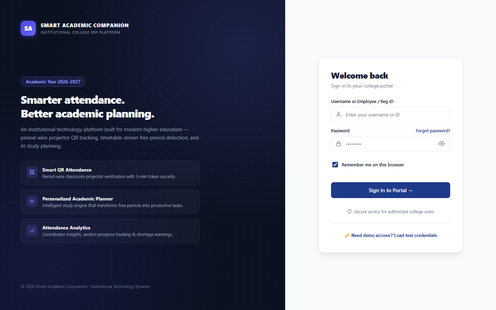 | 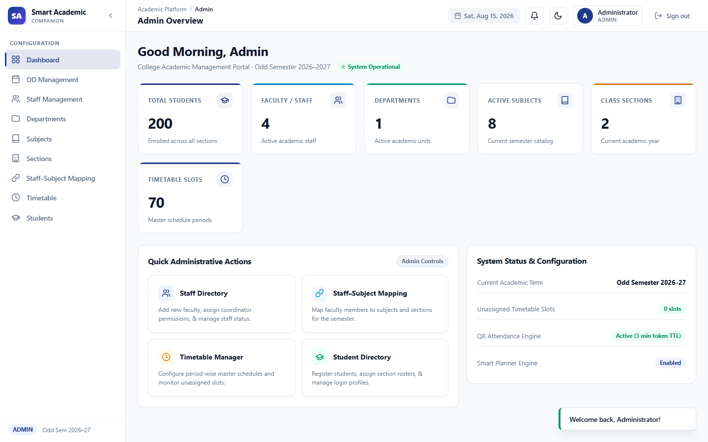 |
| **Admin — Timetable** | **Admin — Students** |
| 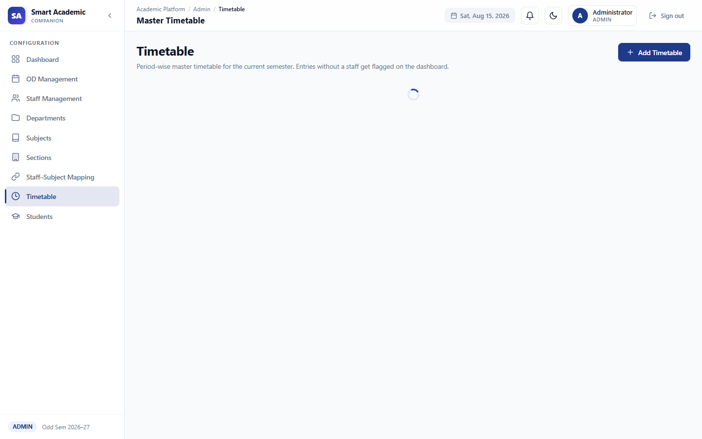 | 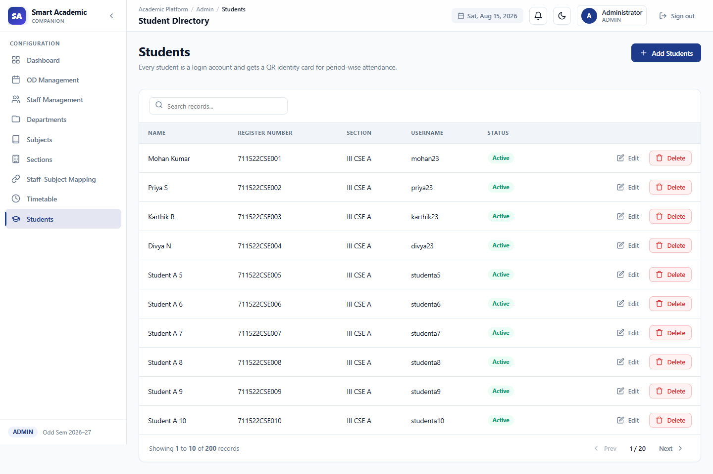 |
| **Teacher — Class Hub** | **Student Dashboard** |
| 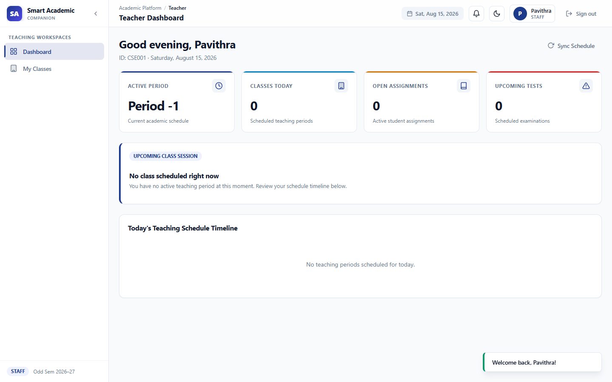 | 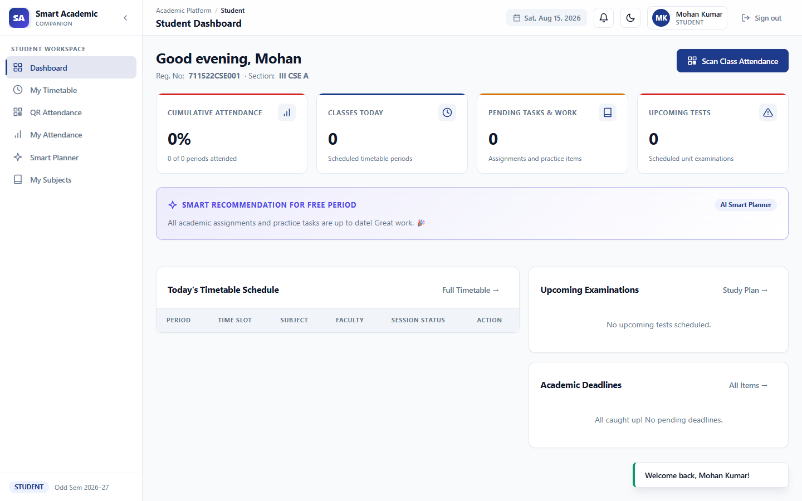 |
| **Teacher — My Classes** | **Student — Smart Study Planner** |
| 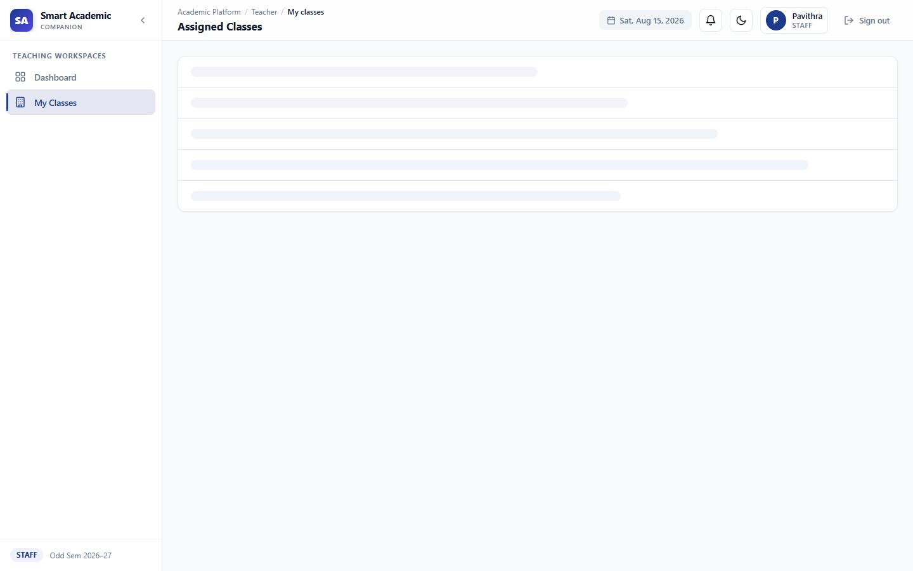 | 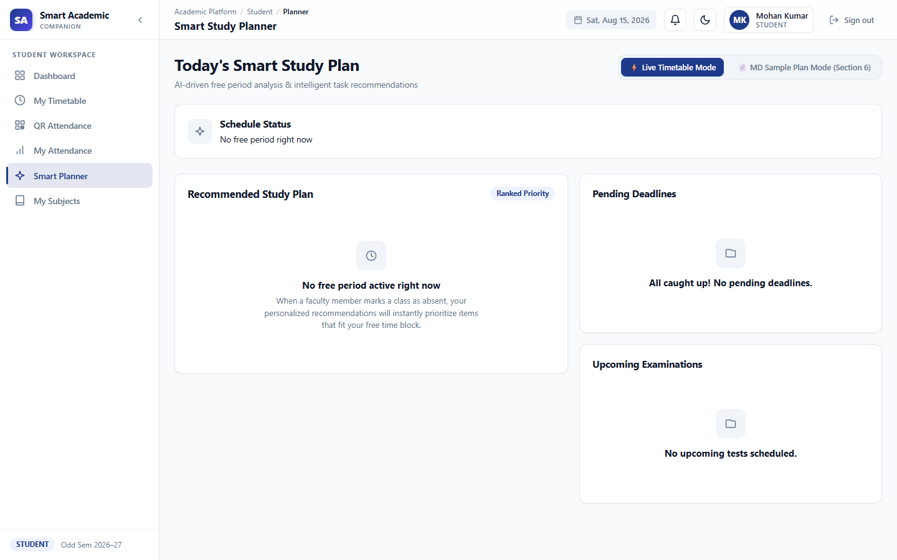 |
| **Coordinator — Attendance Analytics** | **Student — QR Scanner** |
| 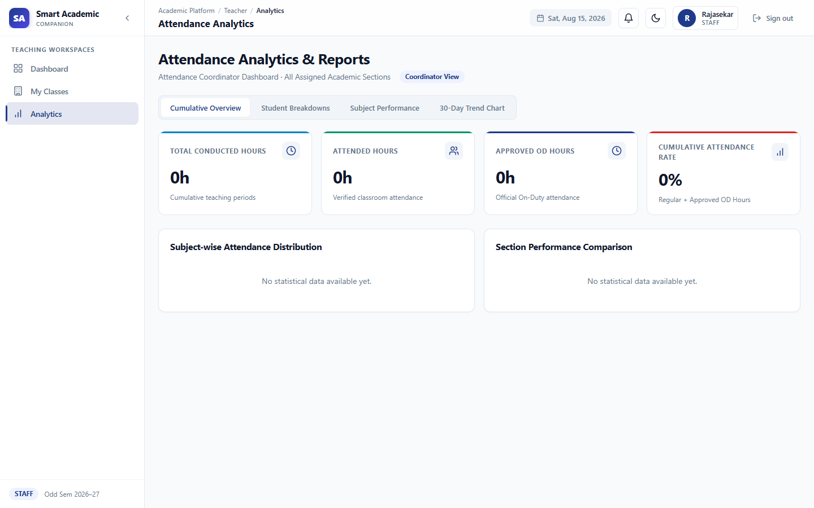 | 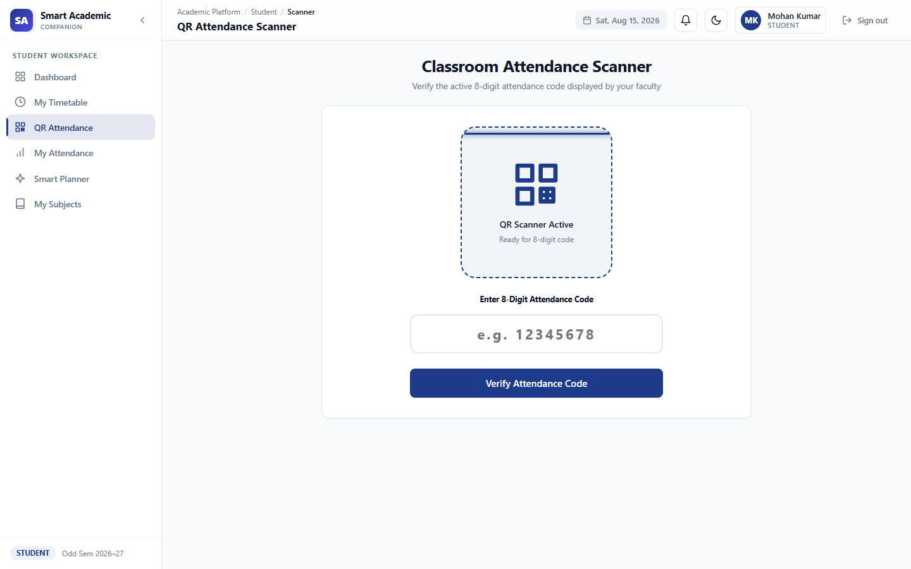 |
| **Student — My Attendance** | |
| 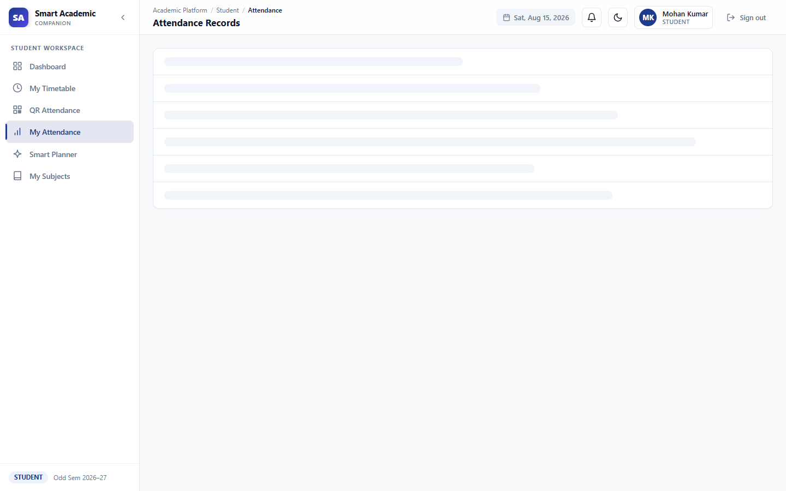 | |

---

## 🏗️ Architecture

A standard three-tier architecture designed for cloud deployment:

```
┌───────────────────────────┐
│  Vercel — React SPA       │   frontend/ (React + TypeScript + Vite)
└─────────────┬─────────────┘
              │  /api/* proxied via vercel.json rewrites
              ▼
┌───────────────────────────┐
│  Render — Spring Boot API │   backend/ (Java 25, JWT, JPA)
└─────────────┬─────────────┘
              │  JDBC (sslmode=require)
              ▼
┌───────────────────────────┐
│  Neon — PostgreSQL 18     │   Serverless cloud database
└───────────────────────────┘
```

- **Frontend Hosting (Vercel):** Serves the static React build with SPA fallback routing and reverse-proxies `/api/*` to the backend (avoids CORS in production).
- **Backend Hosting (Render):** Runs the compiled Spring Boot container, exposing REST endpoints on port `8080`.
- **Database (Neon):** Serverless PostgreSQL hosting the relational academic schema, managed via Hibernate (`ddl-auto: update`).

---

## 🧰 Tech Stack

### Backend
| Technology | Purpose |
| --- | --- |
| **Java 25** + **Spring Boot 4.0.7** | REST API framework |
| **Spring Security** + **JJWT 0.12.6** | Stateless JWT authentication |
| **Spring Data JPA / Hibernate** | ORM & schema management |
| **PostgreSQL 18** | Relational database |

### Frontend
| Technology | Purpose |
| --- | --- |
| **React 19** + **TypeScript 6** | SPA user interface |
| **Vite 8** | Build tooling & dev server |
| **React Router DOM 7** | Client-side routing |
| **qrcode** | QR code generation for attendance sessions |
| **CSS Modules / design tokens** | Navy-indigo design system with dark theme |

---

## 👤 Demo Accounts

| Role | Username | Password |
| --- | --- | --- |
| Admin | `admin` | `Admin@123` |
| Attendance Coordinator | `rajasekar` | `Raj@123` |
| Subject Staff | `pavithra` | `Pav@123` |
| Subject Staff | `arunkumar` | `Arun@123` |
| Subject Staff | `keerthana` | `Kee@123` |
| Student | `mohan23` | `Student@123` |

> Open the **Live Demo**, log in with any account above, and use the QR/token flow to test attendance marking.

---

## 🛠️ Getting Started (Local Development)

### Prerequisites

- **Java 17+** (project targets Java 25)
- **Maven 3.9+**
- **Node.js 18+** (npm bundled)
- **PostgreSQL 18** (local, or a [Neon](https://neon.tech) cloud instance)

### 1. Clone the repository

```bash
git clone https://github.com/methila-2056/AI-Based-Smart-Attendance-System.git
cd AI-Based-Smart-Attendance-System
```

### 2. Create the database

```bash
# Local PostgreSQL
"C:\Program Files\PostgreSQL\18\bin\psql.exe" -U postgres -c "CREATE DATABASE smart_academic;"
```

### 3. Configure environment variables

Create a `.env` in `backend/` (or set OS env vars) with:

```properties
DB_URL=jdbc:postgresql://localhost:5432/smart_academic?sslmode=require
DB_USERNAME=postgres
DB_PASSWORD=your_password
JWT_SECRET=your_long_random_secret
CORS_ORIGINS=http://localhost:5173
```

See [`.env.example`](./.env.example) for the full list.

### 4. Run the backend

```bash
cd backend
mvn spring-boot:run
```

### 5. Run the frontend

```bash
cd frontend
npm install
npm run dev   # serves http://localhost:5173, proxies /api -> localhost:8080
```

### One-command launcher

```bash
python run.py   # starts backend + frontend, waits for readiness, opens the browser
```

---

## 🔐 Environment Variables

| Variable | Required | Description |
| --- | --- | --- |
| `DB_URL` | ✅ | JDBC URL of the PostgreSQL database (`jdbc:postgresql://...`) |
| `DB_USERNAME` | ✅ | Database user |
| `DB_PASSWORD` | ✅ | Database password |
| `JWT_SECRET` | ✅ | Long random string used to sign JWTs |
| `CORS_ORIGINS` | ⬜ | Comma-separated allowed frontend origins |
| `JWT_EXPIRATION_MS` | ⬜ | Token lifetime in ms (default `86400000`) |
| `PORT` | ⬜ | Backend port (Render injects this) |
| `VITE_API_BASE` | ⬜ | Frontend build-time API base URL (optional — dev uses Vite proxy, prod uses Vercel rewrites) |

---

## ☁️ Deployment Guide

This project ships with production config for all three platforms.

### Vercel (Frontend)

- Root `vercel.json` sets the build command, output directory (`frontend/dist`), SPA rewrites, and `/api/*` proxy to the Render backend.
- Import the GitHub repo (`methila-2056/AI-Based-Smart-Attendance-System`) in the Vercel dashboard, or deploy via CLI:
  ```bash
  vercel deploy --prod
  ```

### Render (Backend)

- `backend/Dockerfile` builds a multi-stage Maven → JRE image (`eclipse-temurin:25`) tuned for free-tier memory (`-XX:MaxRAMPercentage=60`).
- The service uses **Docker runtime**, root directory `backend`, branch `main`, free plan.
- Required env vars: `DB_URL`, `DB_USERNAME`, `DB_PASSWORD`, `JWT_SECRET`, `CORS_ORIGINS` (see [Environment Variables](#-environment-variables)).

### Neon (Database)

- Serverless PostgreSQL; the connection string follows `jdbc:postgresql://<host>.neon.tech/neondb?sslmode=require`.
- Schema tables are auto-created by Hibernate on first boot and seeded with demo data (`admin`, `pavithra`, `mohan23`, etc.).

> After deployment, verify with `POST /api/auth/login`:
> ```bash
> curl -X POST https://ai-based-smart-attendance-system-7csy.onrender.com/api/auth/login \
>   -H "Content-Type: application/json" \
>   -d '{"username":"admin","password":"Admin@123"}'
> ```

---

## 📁 Project Structure

```
AI-Based-Smart-Attendance-System/
├── backend/                     # Spring Boot REST API
│   ├── Dockerfile               # Multi-stage build for Render
│   ├── pom.xml                  # Maven configuration (Java 25)
│   └── src/main/java/com/smartacademic/
│       ├── admin/               # Admin dashboards & section management
│       ├── attendance/          # Sessions, records, QR token service
│       ├── auth/                # Login & JWT issuing
│       ├── content/             # Study planner (tasks, assignments, resources)
│       ├── master/              # Academic ERP (students, staff, timetables)
│       ├── student/             # Student dashboards
│       ├── teacher/             # Faculty class hub & QR generator
│       ├── config/              # Security config & seeders
│       └── security/            # JWT filter, stateless sessions
├── frontend/                    # React + TypeScript + Vite SPA
│   └── src/
│       ├── api/                 # API client & typed DTOs
│       ├── auth/                # Auth context & route guards
│       ├── components/          # UI primitives & layout shells
│       ├── pages/               # admin / analytics / student / teacher / login
│       └── styles/              # Design tokens & global CSS
├── run.py                       # One-command local launcher
├── vercel.json                  # Frontend build + /api proxy config
├── .env.example                 # Documented environment variables
└── README.md
```

---

## 📄 License

This project is released under the **MIT License**.

---

<p align="center">
  Built with ❤️ as part of the <strong>Smart Education</strong> hackathon track.
  <br/>
  <a href="https://github.com/methila-2056/AI-Based-Smart-Attendance-System">GitHub</a> ·
  <a href="https://ai-based-smart-attendance-system-omega.vercel.app">Live Demo</a> ·
  <a href="https://ai-based-smart-attendance-system-7csy.onrender.com">Backend API</a>
</p>
